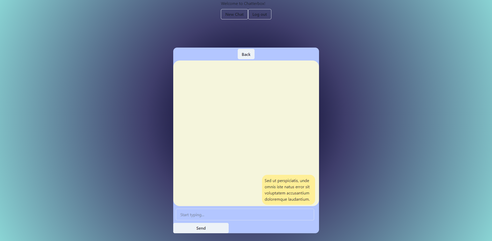

# Chatter-Box 500

## Description

A fullstack MERN based Real time chat app inspired by Messenger and Discord. Built using MongoDb and Mongoose with graphql for database, Express.js and Node.js for server functionality, Using react for the front-end. Users can register an account which will be authenticated upon login, allowing the user to message friends in chat threads. Deployed using Heroku Web Services.

## Messenger Page
link to live deployment: https://chatter-box-500.herokuapp.com/

## Contributors

Created by:
Daniel Christy
https://github.com/danielc53 ,

Junior Cabriales-Rodriguez
https://github.com/Jacksonwolfd20 ,

Mitchell Foote
https://github.com/mcfoote ,

Isain Ibarra
https://github.com/isain1
